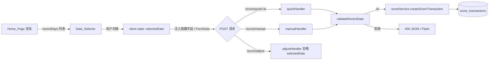

# 设计文档

## 概述（Overview）

本特性为小月积分应用首页新增 **Date_Selector**：一个仅含三个选项（今天、昨天、前天）的日期选择器，用于让使用者在执行 Quick_Action 与 Manual_Record 之前指定一笔流水的发生日期。Adjust_Score 不受影响。

设计目标：

- 在不引入数据库结构变更的前提下，把 Selected_Date 写入 `score_transactions.created_at` 的日期部分；
- 保留 `created_at` 的时间部分为服务端当前时刻，从而维持原有 `ORDER BY created_at DESC, id DESC` 与 `balance_after` 写入顺序之间的一致性；
- 保持总积分仍然按"流水写入顺序"累计的语义不变（不做任何回填或重算）；
- 服务端做白名单校验，避免被绕过前端写入任意历史日期。

## 架构（Architecture）

### 数据流



### 关键设计决策

1. **Selected_Date 仅存在于浏览器内存中**：刷新即重置为 Server_Today，简化 SSR/CSR 状态同步。Requirement 1.4 要求"Home_Page 被加载时初始化为 Server_Today"，因此不需要持久化。
2. **服务端是日期权威**：`recentDays` 由后端按 `Asia/Shanghai`（服务器本地）计算并写入页面初始上下文，前端不依赖 `Date.now()` 推断"今天"。这样可以避免客户端时区/时钟偏差导致的越界。
3. **`created_at` 的合成方式**：`selectedDate(YYYY-MM-DD) + 当前服务端时刻(HH:MM:SS)` 拼成 `DATETIME`。
   - 对 `Server_Today`：等价于 `NOW()`；
   - 对昨天 / 前天：日期部分回退、时间部分仍为"现在"。
   这样可以同时满足：
   - Requirement 7.x：按 `DATE(created_at)` 归类的日期等于 Selected_Date；
   - 仍然保留 `ORDER BY created_at DESC, id DESC` 在同一天内按写入顺序排序的语义；
   - Requirement 6.x：`balance_after` 仍然按真实写入顺序（即 `id` 顺序）累加，不会被回填。
4. **Adjust_Score 不参数化日期**：`/score/adjust` 不读取 `selectedDate`，由 `adjustScore` 内部固定使用 `NOW()`，与 Requirement 4 一致。
5. **白名单校验**：服务端把"允许日期集合"重新计算后再比对，而非信任前端传入的标签（"今天"/"昨天"），覆盖 Requirement 5、9。

## 组件与接口（Components and Interfaces）

### 1. 前端：Date_Selector

#### 渲染

在 `src/views/index.ejs` 的 `score-panel` 与 `action-card` 之间插入一段 EJS：

```html
<section class="card date-selector-card" aria-labelledby="date-selector-title">
  <div class="date-selector-head">
    <h2 id="date-selector-title">记到哪一天</h2>
    <p class="muted form-hint">选择后，快捷加减分和手动记录会写到这一天。</p>
  </div>
  <div class="date-selector" role="radiogroup" aria-label="选择记账日期" data-date-selector>
    <% recentDays.forEach(function(day, index) { %>
      <button
        type="button"
        class="date-chip <%= index === 0 ? 'active' : '' %>"
        role="radio"
        aria-checked="<%= index === 0 ? 'true' : 'false' %>"
        data-date-value="<%= day.value %>"
        data-date-label="<%= day.label %>"
      >
        <span class="date-chip-label"><%= day.label %></span>
        <span class="date-chip-date"><%= day.shortDate %></span>
      </button>
    <% }) %>
  </div>
</section>
```

页面 locals 新增：

```js
{
  recentDays: [
    { value: '2025-01-12', label: '今天', shortDate: '01-12' },
    { value: '2025-01-11', label: '昨天', shortDate: '01-11' },
    { value: '2025-01-10', label: '前天', shortDate: '01-10' }
  ]
}
```

#### 状态与交互

新建模块 `public/date-selector.js`，由 `index.ejs` 引入。它负责：

- 维护 `currentSelectedDate`（默认为 `recentDays[0].value`）；
- 监听点击 / `Enter` / 方向键（使其作为可访问的 `radiogroup`）；
- 在切换时更新 DOM 的 `aria-checked`、`active` 类；
- 暴露一个 `getSelectedDate()` 给同页面其它脚本。

`public/app-actions.js` 在提交 `async-score-form` 时：

```js
const selector = document.querySelector('[data-date-selector]');
const includeDate = form.dataset.includeSelectedDate !== '0';
if (selector && includeDate) {
  body.set('selectedDate', selector.querySelector('[aria-checked="true"]').dataset.dateValue);
}
```

`index.ejs` 中只有快捷项表单与"手动记录"表单标记为参与日期注入；"设置总积分"表单加 `data-include-selected-date="0"`，并在表单旁追加 `<p class="form-hint">设置总积分始终记在今天。</p>`，对应 Requirement 4.2。

#### 浏览器降级

- 如果脚本未加载，`button[type="button"]` 不会触发提交，使用者无法发起带 `selectedDate` 的请求。此时表单仍可提交，服务端按 Requirement 2.3 / 3.3 默认 Server_Today。这是可接受的降级。
- 不读取 `localStorage`，跨日切换由服务端在每次提交时校验（Requirement 9.1）。

### 2. 后端：日期校验工具

新建 `src/utils/dateUtils.js`，无依赖、纯函数，便于单元测试与属性测试：

```js
const DATE_RE = /^\d{4}-\d{2}-\d{2}$/;

function pad2(n) { return n < 10 ? `0${n}` : String(n); }

function formatYmd(date) {
  return `${date.getFullYear()}-${pad2(date.getMonth() + 1)}-${pad2(date.getDate())}`;
}

function getServerToday(now = new Date()) {
  return formatYmd(now);
}

function getRecentDays(now = new Date(), count = 3) {
  const result = [];
  const labels = ['今天', '昨天', '前天'];
  for (let i = 0; i < count; i += 1) {
    const d = new Date(now.getFullYear(), now.getMonth(), now.getDate() - i);
    result.push({
      value: formatYmd(d),
      label: labels[i] ?? `${i}天前`,
      shortDate: `${pad2(d.getMonth() + 1)}-${pad2(d.getDate())}`
    });
  }
  return result;
}

function isYmd(value) {
  if (typeof value !== 'string' || !DATE_RE.test(value)) return false;
  const [y, m, d] = value.split('-').map(Number);
  const date = new Date(y, m - 1, d);
  return (
    date.getFullYear() === y &&
    date.getMonth() === m - 1 &&
    date.getDate() === d
  );
}

function isWithinRecentDays(value, now = new Date(), count = 3) {
  if (!isYmd(value)) return false;
  return getRecentDays(now, count).some((d) => d.value === value);
}

function buildTransactionDateTime(selectedDate, now = new Date()) {
  // selectedDate: 'YYYY-MM-DD'，now：服务端当前时刻
  // 输出：JS Date，日期 = selectedDate，时间 = now 的 HH:MM:SS（毫秒清零或保留均可）
  const [y, m, d] = selectedDate.split('-').map(Number);
  return new Date(
    y,
    m - 1,
    d,
    now.getHours(),
    now.getMinutes(),
    now.getSeconds(),
    now.getMilliseconds()
  );
}

module.exports = {
  formatYmd,
  getServerToday,
  getRecentDays,
  isYmd,
  isWithinRecentDays,
  buildTransactionDateTime
};
```

错误信号统一通过抛 `Error`，由路由层捕获并转换成 400 响应。错误消息文本固定如下，与 Requirement 5.2 / 5.3 一致：

| 触发条件 | 错误消息 |
| --- | --- |
| `selectedDate` 字段缺失 | （不抛错，按 Requirement 2.3 / 3.3 默认 Server_Today） |
| 格式不匹配 `YYYY-MM-DD` 或非合法日历日 | `日期格式不正确。` |
| 格式合法但不在最近 3 天内 | `所选日期不在最近 3 天内。` |

校验顺序：先判格式，再判范围。

### 3. 后端：路由改造

`src/routes/pages.js` 三个 POST handler 的改动：

#### `/score/quick/:id`

```js
router.post('/score/quick/:id', async (req, res) => {
  try {
    const selectedDate = resolveSelectedDate(req.body.selectedDate); // 抛错或返回 'YYYY-MM-DD'
    const balanceAfter = await applyQuickItem(req.params.id, { selectedDate });
    // ...
  } catch (error) {
    // 400 JSON 或 flash
  }
});
```

#### `/score/manual`

类似上面，校验后将 `selectedDate` 透传给 `applyManualScore`。

#### `/score/adjust`

不读取 `req.body.selectedDate`。`adjustScore` 内部使用 `NOW()`。

`resolveSelectedDate(value)` 助手：

```js
function resolveSelectedDate(raw) {
  if (raw === undefined || raw === null || raw === '') return null; // 表示 "today"
  if (!isYmd(raw)) {
    throw new Error('日期格式不正确。');
  }
  if (!isWithinRecentDays(raw)) {
    throw new Error('所选日期不在最近 3 天内。');
  }
  return raw;
}
```

返回 `null` 表示由服务层默认使用 Server_Today（覆盖 Requirement 2.3 / 3.3）。

### 4. 后端：scoreService 接口签名变更

为了把 Selected_Date 注入到 `INSERT` 语句中，`createScoreTransaction` 增加可选参数，其它对外函数也增加 `selectedDate` 选项：

```js
// 旧
applyQuickItem(id);
applyManualScore(pointsDelta, reason);
createScoreTransaction({ type, pointsDelta, reason, source, quickItemId });

// 新
applyQuickItem(id, options = {});
applyManualScore(pointsDelta, reason, options = {});
createScoreTransaction({
  type, pointsDelta, reason, source,
  quickItemId = null,
  selectedDate = null            // 新增；null 表示 Server_Today
});
```

`adjustScore(targetScore, reason)` 签名不变。

`createScoreTransaction` 内部计算 `createdAt`：

```js
const createdAt = selectedDate
  ? buildTransactionDateTime(selectedDate, new Date())
  : null; // null 表示沿用 DB 默认值 CURRENT_TIMESTAMP
```

`INSERT` 改造为带可选 `created_at`：

```sql
INSERT INTO score_transactions
  (type, points_delta, reason, source, quick_item_id, balance_after, created_at)
VALUES (?, ?, ?, ?, ?, ?, COALESCE(?, CURRENT_TIMESTAMP))
```

`mysql2` 会按 JS `Date` 对象序列化为 `YYYY-MM-DD HH:MM:SS`，写入 `TIMESTAMP` 列时使用服务端会话时区，与既有数据保持一致。

### 5. 视图层兼容

- `transactions.ejs` 不需要修改：它已经通过 `new Date(item.created_at).toLocaleString('zh-CN')` 展示；并且 `getTransactionStats` 里的 `DATE(created_at)` 与 `WHERE created_at >= DATE_SUB(CURRENT_DATE, INTERVAL ? DAY)` 自然按 Selected_Date 归类，对应 Requirement 7.1 / 7.2 / 7.3 直接生效，无须额外改动。
- 注意：`getTransactionStats` 的 `WHERE created_at >= DATE_SUB(CURRENT_DATE, INTERVAL N DAY)` 使用 MySQL 服务器日期，与 Node 端 `Date` 假设的时区保持一致；如部署到容器时区为 UTC，需要确认 MySQL session timezone 与 Node 时区一致。这一约束在文档（`docs/development.md`）中加一条提示即可，本特性不引入额外代码。

### 6. 样式（`public/styles.css`）

追加：

```css
.date-selector-card { padding: 14px; }
.date-selector-head { display: grid; gap: 4px; margin-bottom: 8px; }
.date-selector {
  display: grid;
  grid-template-columns: repeat(3, minmax(0, 1fr));
  gap: 6px;
  border-radius: 18px;
  padding: 6px;
  background: #fff9ef;
}
.date-chip {
  display: grid;
  align-content: center;
  justify-items: center;
  gap: 2px;
  min-height: 56px;        /* 满足 Requirement 8.1：≥40px 可点击区域 */
  border: 0;
  border-radius: 14px;
  padding: 8px 10px;
  color: var(--muted);
  background: transparent;
  cursor: pointer;
  font-weight: 900;
}
.date-chip:focus-visible {  /* Requirement 8.3 */
  outline: 2px solid var(--primary);
  outline-offset: 2px;
}
.date-chip.active {
  color: var(--ink);
  background: linear-gradient(135deg, #ffe18f, #ffd1a8);
  box-shadow: inset 0 -3px 0 rgba(0, 0, 0, 0.08);
}
.date-chip-label { font-size: 14px; }
.date-chip-date { color: var(--muted); font-size: 12px; }
.date-chip.active .date-chip-date { color: var(--primary-deep); }

@media (max-width: 460px) {
  .date-chip { min-height: 52px; }
  .date-chip-label { font-size: 13px; }
}
```

`role="radiogroup"` + `aria-checked` 的组合满足 Requirement 8.2；`focus-visible` 满足 8.3；`min-height: 56px` 与栅格布局保证 Requirement 8.1。

## 数据模型（Data Models）

### `score_transactions` 表

**不做结构变更。** 复用 `created_at TIMESTAMP DEFAULT CURRENT_TIMESTAMP`。

| 列 | 写入策略变化 |
| --- | --- |
| `type` | 不变 |
| `points_delta` | 不变 |
| `reason` | 不变 |
| `source` | 不变 |
| `quick_item_id` | 不变 |
| `balance_after` | 不变；仍按写入顺序累计（Requirement 6.1 / 6.2 / 6.3） |
| `created_at` | **新策略**：当 `source ∈ {quick, manual}` 且请求带合法 `selectedDate` 时，写入 `selectedDate + 当前 HH:MM:SS`；否则写入 `CURRENT_TIMESTAMP`。`source = adjust` 始终写 `CURRENT_TIMESTAMP`。 |

### 请求 Schema

新增字段（仅出现在 `/score/quick/:id` 与 `/score/manual` 的请求体）：

| 字段 | 类型 | 约束 | 备注 |
| --- | --- | --- | --- |
| `selectedDate` | string | `^\d{4}-\d{2}-\d{2}$` 且必须等于 Server_Today、Server_Today-1、Server_Today-2 之一 | 缺省 / 空串 → 视为 Server_Today |

### 视图层数据

`GET /` 返回的 EJS locals 新增 `recentDays`，结构见上文。

### 跨日场景

- 服务端在每次请求处理时调用 `getRecentDays(new Date())`，因此凌晨切日后老页面提交的 `selectedDate` 自动失效（Requirement 9.1 / 9.2）。
- 失效请求按 Requirement 5.2 返回 `400` + `所选日期不在最近 3 天内。`，前端按现有的 flash 错误展示。
- 老页面的 Date_Selector UI 标签（"今天/昨天/前天"）此时会出现一次性偏差，由使用者刷新页面解决。本特性不主动检测跨日并自动刷新（避免引入心跳/计时器复杂度）。

## 正确性属性（Correctness Properties）

*属性（property）是在系统所有合法执行下都应当成立的特征或行为，是对"系统应该做什么"的形式化陈述。属性是把人类可读的需求转换成可被机器验证的正确性保证的桥梁。*

下列属性来源于 `requirements.md` 的验收标准，并经过去重合并（详见 prework）。每个属性都使用全称量词（"对任意…"），并标注其覆盖的需求条款。被合并掉的需求会出现在多个属性的 Validates 列表中，由蕴含关系覆盖的需求（7.1、9.2 等）一并附在 Validates 中。

### Property 1: 最近三天列表的形态正确

*对任意* JS `Date` 实例 `now`，`getRecentDays(now)` 返回的数组长度恰好为 3，且第 `i` 项满足：`value` 等于 `formatYmd(now - i 个自然日)`、`label` 依次为 `'今天'/'昨天'/'前天'`、`shortDate` 等于该日期的 `MM-DD` 形式，并且 `value` 严格降序排列。

**Validates: Requirements 1.2, 1.3**

### Property 2: 首页加载后初始 Selected_Date 等于 Server_Today

*对任意* `recentDays` 列表，渲染后的 Date_Selector 中恰好一个 chip 的 `aria-checked` 为 `true`，且其 `data-date-value` 等于 `recentDays[0].value`。

**Validates: Requirements 1.4**

### Property 3: 切换后选中态唯一

*对任意* 由用户操作产生的"点击 chip / 用方向键聚焦并按下 Enter / Space"事件序列，事件处理结束后 Date_Selector 中所有 chip 的 `aria-checked` 属性恰有一个为 `'true'`，其余均为 `'false'`，且为 `'true'` 的那一项就是最后一次被激活的 chip。

**Validates: Requirements 1.5, 8.2**

### Property 4: 参与日期的表单提交体一定带 selectedDate

*对任意* 标记为 `async-score-form` 且未设置 `data-include-selected-date="0"` 的表单，在 Date_Selector 存在时由 `app-actions.js` 发出的 `fetch` 请求体里必须含有键 `selectedDate`，其值等于当时 `aria-checked='true'` 的 chip 的 `data-date-value`。

**Validates: Requirements 2.1, 3.1**

### Property 5: 合法 selectedDate 决定流水的日期部分

*对任意* `source ∈ {quick, manual}` 的请求与 `getRecentDays(now)` 内任一 `value` 作为 `selectedDate` 的输入，调用相应 API 成功后查询写入的流水，`DATE(created_at)` 必须等于 `selectedDate`。

**Validates: Requirements 2.2, 3.2, 7.1**

### Property 6: 缺省 selectedDate 等价于 Server_Today

*对任意* `source ∈ {quick, manual}` 的请求，当请求体中不含 `selectedDate` 或其值为空字符串时，调用相应 API 成功后写入的流水 `DATE(created_at)` 必须等于服务端处理该请求时刻的 `Server_Today`。

**Validates: Requirements 2.3, 3.3**

### Property 7: Quick_Action 成功后 Selected_Date 保持

*对任意* 在 Date_Selector 上选定的 `selectedDate` 与任意启用中的快捷项，提交 `/score/quick/:id` 并成功（HTTP 2xx 且 `ok: true`）之后，Date_Selector 中 `aria-checked='true'` 的 chip 仍是同一个，`data-date-value` 仍等于提交时的 `selectedDate`。

**Validates: Requirements 2.4**

### Property 8: Adjust_Score 与 selectedDate 解耦

*对任意* `selectedDate`（包括 `null`、最近 3 天中任一值、格式非法值、越界值），通过 `/score/adjust` 写入的流水必有 `DATE(created_at) = Server_Today`，且响应的成功/失败仅由 `targetScore` 与 `reason` 的合法性决定，不受 `selectedDate` 影响。

**Validates: Requirements 4.1**

### Property 9: 越界日期被拒绝并报固定文案

*对任意* 满足 `^\d{4}-\d{2}-\d{2}$` 且能被解析为合法日历日、但不属于 `getRecentDays(now)` 三个 `value` 之一的字符串 `s`，调用 `resolveSelectedDate(s, now)` 必抛 `Error`，其 `message` 严格等于 `'所选日期不在最近 3 天内。'`；并且通过 HTTP 提交时响应 `status === 400` 且 `body.message` 等于该文案，且 `score_transactions` 表与 `settings.current_score` 在请求前后保持不变。

**Validates: Requirements 5.1, 5.2**

### Property 10: 格式非法日期被拒绝并报固定文案

*对任意* 不匹配 `^\d{4}-\d{2}-\d{2}$` 的字符串，或匹配该格式但不能被解析为合法日历日（如 `2025-02-30`、`2024-13-01`、`9999-99-99`）的字符串 `s`，调用 `resolveSelectedDate(s, now)` 必抛 `Error`，其 `message` 严格等于 `'日期格式不正确。'`；并且通过 HTTP 提交时响应 `status === 400` 且 `body.message` 等于该文案，且 `score_transactions` 表与 `settings.current_score` 在请求前后保持不变。

**Validates: Requirements 5.3**

### Property 11: 总积分按写入顺序累计

*对任意* 起始 `current_score = S0` 与任意有限的 `(selectedDate, pointsDelta)` 序列（其中 `selectedDate` 全部合法、`pointsDelta` 全部合法），按顺序提交 `/score/quick/:id` 或 `/score/manual` 之后：
- `settings.current_score = S0 + Σ pointsDelta_i`；
- 第 `k` 笔流水的 `balance_after = S0 + Σ_{i ≤ k} pointsDelta_i`，与 `selectedDate` 的取值（包括是否早于已存在流水）无关。

**Validates: Requirements 6.1, 6.2**

### Property 12: 已存在流水的 balance_after 永不被修改

*对任意* 已写入流水序列 `T = [t_1, …, t_n]` 与任意后续合法操作（含 `selectedDate` 早于 `t_n.created_at` 的流水），新操作完成后对所有 `i ∈ [1, n]`：`t_i.balance_after` 与 `t_i.created_at` 保持不变。

**Validates: Requirements 6.3**

### Property 13: getTransactionStats 按 Selected_Date 归类

*对任意* 由若干 `(selectedDate, pointsDelta)` 写入产生的流水集合，对任意 `days ∈ [1, 90]`，`getTransactionStats(days).daily` 中 `day = D` 的桶的 `add_points / subtract_points / net_points` 必须等于所有 `selectedDate = D` 且 `D` 落在最近 `days` 天窗口内的流水按符号汇总的结果；尤其当某笔流水的 `selectedDate = '昨天'` 或 `'前天'` 时，它必须出现在该日的桶里、而不是 `Server_Today` 的桶里。

**Validates: Requirements 7.2, 7.3**

### Property 14: 跨日后老 selectedDate 自动失效

*对任意* 时刻 `t1`、`selectedDate s` 与时刻 `t2`，若 `s ∈ getRecentDays(t1).value 集合` 且 `t2 - t1 ≥ 4 天`（即 `s` 已不在 `getRecentDays(t2).value 集合` 中），则 `isWithinRecentDays(s, t2) === false`，`resolveSelectedDate(s, t2)` 抛 `'所选日期不在最近 3 天内。'`。

**Validates: Requirements 9.1, 9.2**

### 不可作为属性测试覆盖的需求

下列需求本身有效且必须满足，但不适合用属性测试自动覆盖，将在 Testing Strategy 中以单元/集成/手工方式覆盖：

- **1.1**：DOM 存在性，由 EJS 渲染快照断言覆盖。
- **4.2**：表单旁的文字说明，由 DOM 内容断言覆盖。
- **8.1 / 8.3**：视觉与布局（`min-height ≥ 40px`、`focus-visible` 样式），由手工验收 + 简单 DOM/CSS 单元断言覆盖。

## 错误处理（Error Handling）

| 场景 | HTTP 状态 | 响应体 (`wantsJson`) | 副作用 |
| --- | --- | --- | --- |
| `selectedDate` 缺失 | 200 | `{ ok: true, currentScore }` | 写入 `created_at = NOW()` |
| `selectedDate` 非 `YYYY-MM-DD` | 400 | `{ ok: false, message: '日期格式不正确。' }` | 不写入流水 |
| `selectedDate` 合法但越界（≥3 天前 / 未来 / 跨日失效） | 400 | `{ ok: false, message: '所选日期不在最近 3 天内。' }` | 不写入流水 |
| `applyQuickItem` 内业务错误（快捷项不存在） | 400 | `{ ok: false, message: '快捷项不存在或已停用。' }` | 不写入流水 |
| 数据库异常 | 500（由全局 error handler） | EJS 错误页 / 500 JSON | 事务回滚 |

非 JSON 请求（页面表单 fallback）按既有约定 `req.flash('error', ...)` 后 `res.redirect('/')`，与现有路由风格一致。所有 `selectedDate` 相关错误均由 `resolveSelectedDate` 集中抛出，路由层将其转为 `400 + JSON` 或 `flash + redirect`，满足 Requirement 5.1–5.3 / 9.2 的"拒绝、不写入、固定文案"要求。

## 测试策略（Testing Strategy）

### 双轨测试

我们采用 **单元测试 + 属性测试** 组合：

- **单元测试**：覆盖具体例子、边界值、UI 静态结构（DOM 存在性、文案）、错误条件；
- **属性测试**：覆盖上一节列出的 14 个全称属性，验证系统在大量随机输入下都满足规范。

两类测试相互补充：单元测试抓具体回归，属性测试抓一般性 bug。

### 工具选型

- **测试框架**：选用 **Vitest**（与 Node 20 / ESM 兼容性好、零配置）。
  - 不引入新的 mock 服务器，HTTP 路由测试直接用 `supertest` 套在 Express app 上。
- **属性测试库**：选用 **fast-check**（npm: `fast-check`，是 JS 生态中事实上的 PBT 标准库）。
  - **绝不**自行实现 PBT 引擎；统一使用 `fc.property` / `fc.assert` 提供的 API。
- **DOM 测试**：使用 **jsdom**（Vitest 内置）。
  - 直接以 EJS 渲染出的 HTML 字符串注入 `document.body`，再加载 `public/date-selector.js` 与 `public/app-actions.js` 做交互断言。

新增依赖：

```jsonc
"devDependencies": {
  "vitest": "^2",
  "fast-check": "^3",
  "supertest": "^7",
  "@vitest/expect": "^2"
}
```

### 测试组织

```
tests/
  unit/
    dateUtils.test.js           // P1, P9, P10, P14 + 边界例子
    routes-validation.test.js   // P9, P10 (HTTP 层面)
    dom-render.test.js          // 1.1 / 4.2 / 8.1 / 8.3 的可测部分
  property/
    dateUtils.property.test.js  // P1, P9, P10, P14
    scoreService.property.test.js // P5, P6, P11, P12
    stats.property.test.js      // P13
    dateSelector.property.test.js // P3, P4, P7（jsdom）
    adjust.property.test.js     // P8
  integration/
    score-flow.test.js          // P5, P6 端到端 (supertest + 测试 DB)
```

### 属性测试约束

为了让 14 个属性都被单独的 PBT 测试覆盖：

- **每个属性 ⇄ 一个 PBT 测试**：每个 `Property N` 必须由且仅由一个 `fc.assert(fc.property(...))` 实现。
- **最小迭代次数 100**：所有属性测试调用 `fc.assert(p, { numRuns: 100 })`（或更高）。
- **设计文档引用注释**：每个属性测试上方追加一行注释：

  ```
  // Feature: recent-days-score-selection, Property N: <property text>
  ```

  其中 `<property text>` 与设计文档中该属性正文一字不差。

- **生成器要点**：
  - 时间：`fc.date({ min: new Date('2000-01-01'), max: new Date('2099-12-31') })`，避开闰秒/夏令时引入的边界；
  - 日期字符串非法集合：用 `fc.string()` + filter，再加显式预设 `['2025-13-01', '2025-02-30', 'abcd-ef-gh', '', '2025-1-1']`；
  - 流水序列：`fc.array(fc.tuple(recentDateArb, fc.integer({ min: -1000, max: 1000 }).filter(n => n !== 0)), { minLength: 0, maxLength: 50 })`。

### 单元测试约束

- 不为已被属性测试完全覆盖的逻辑再补具体例子，除非这些例子是已知历史回归点；
- DOM 渲染断言使用单一例子（如 `now = 2025-01-12`），断言三个 chip 的 `data-date-value` 列表与 `aria-checked` 状态；
- "设置总积分"附近的说明文案用一条 `expect(html).toContain('设置总积分始终记在今天。')` 覆盖 Requirement 4.2。

### 集成测试约束

- 使用一个临时 schema（`xiaoyue_jifen_test_*`）+ `withTransaction` 回滚，避免污染开发库；
- 每个集成测试在 `beforeEach` 重置 `settings.current_score = 0` 并 `TRUNCATE score_transactions`；
- 对 P11 / P12 / P13，把 `getTransactionStats` 的窗口拉到 90 天以避免测试随机日期被窗口截断。

### 验收闭环

- 在 `package.json` 中追加：

  ```json
  "scripts": {
    "test": "vitest --run",
    "test:property": "vitest --run tests/property"
  }
  ```

- CI 与本地均使用 `npm test`（一次性执行，不进入 watch 模式）。

